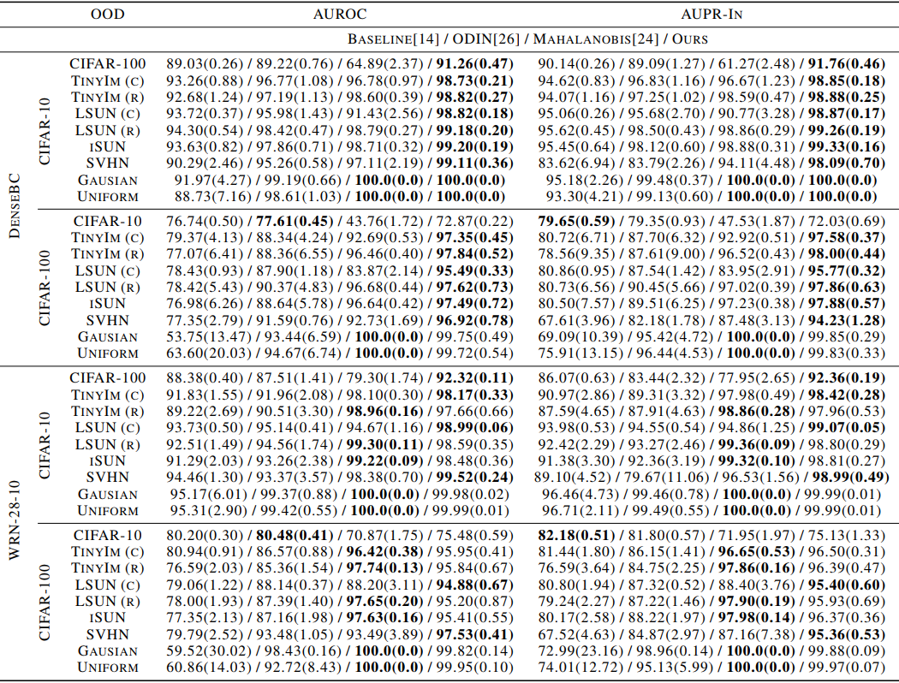

# Hyperparameter-Free Out-of-Distribution Detection Using Softmax of Scaled Cosine Similarity

This repository is an [PyTorch](https://pytorch.org/) implementation for to paper __"Hyperparameter-Free Out-of-Distribution Detection Using Softmax of Scaled Cosine Similarity" [[arxiv]](https://arxiv.org/abs/1905.10628) by Engkarat Techapanurak and Takayuki Okatani__. Influenced by metrics learning, our classifier is built utilizing the cosine similarity with scaling factor. It allows our network to improve ability on out-of-distribution detection. The results from paper are shown below.

If you find this work useful in your research, please cite:
~~~
@article{techapanurak2019cosine,
  title={Hyperparameter-free out-of-Distribution detection using softmax of scaled cosine similarity},
  author={Techapanurak, Engkarat and Okatani, Takayuki},
  journal={arXiv:1905.10628},
  year={2019}
}
~~~

## Datasets and Checkpoints

Datasets and checkpoints used in this implementation can be downloaded at [datasets](https://drive.google.com/file/d/1eTtBQBUi6wQWzJrixOk2wcq15o2tN7P7/view?usp=sharing) and [checkpoints](https://drive.google.com/file/d/1KgBniS17mpw_-oKDisEAEp4bIL0GT0BO/view?usp=sharing). For datasets, please extract and store them below *'data'* directory such that *'./data/ood_dataset/'* exists. For checkpoint, please put them below *'ckpt'* directory such that *'./ckpt/std/'* and *'./ckpt/cos/'* exist.

## Requirements

Please install required packages, using this command:
~~~
pip install -r requirements.txt
~~~

Other requirements:
- GPU: 1 unit
- Python version: 3.7

## Running the code

### 1. Using pre-trained checkpoints

To examine the out-of-distribution detection result using pre-trained network, checkpoints should be stored as described above. Then, run commands:

__Standard Network__

~~~
# Standard DenseNet with CIFAR-10
python std_ood_detector.py --nn dense-100 --tr_dset cifar10
~~~

~~~
# Standard DenseNet with CIFAR-100
python std_ood_detector.py --nn dense-100 --tr_dset cifar100
~~~

~~~
# Standard WRN-28-10 with CIFAR-10
python std_ood_detector.py --nn wrn-28-10 --tr_dset cifar10
~~~

~~~
# Standard WRN-28-10 with CIFAR-100
python std_ood_detector.py --nn wrn-28-10 --tr_dset cifar100
~~~

__Scaled Cosine Network__

~~~
# Scaled Cosine DenseNet with CIFAR-10
python cosine_ood_detector.py --nn dense-100 --tr_dset cifar10
~~~

~~~
# Scaled Cosine DenseNet with CIFAR-100
python cosine_ood_detector.py --nn dense-100 --tr_dset cifar100
~~~

~~~
# Scaled Cosine WRN-28-10 with CIFAR-10
python cosine_ood_detector.py --nn wrn-28-10 --tr_dset cifar10
~~~

~~~
# Scaled Cosine WRN-28-10 with CIFAR-100
python cosine_ood_detector.py --nn wrn-28-10 --tr_dset cifar100
~~~

### 2. Training from scratch

To re-confirm the out-of-distribution detection performance, network can also be trained from scratch. To do so, one needs to remove checkpoint files of that specific task, e.g. running scaled cosine DenseNet with CIFAR-10 from scratch requires *./ckpt/cos/dense-100/cifar10/* to be empty, no any checkpoint exists in the directory.
